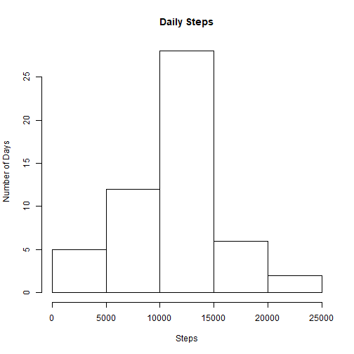
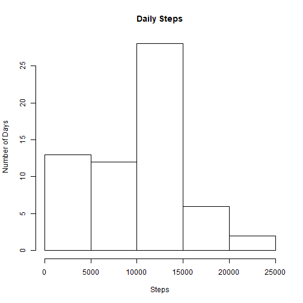
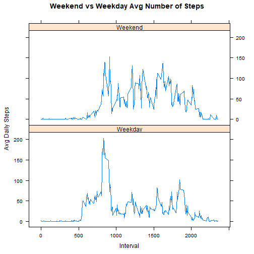

## Introduction

It is now possible to collect a large amount of data about personal
movement using activity monitoring devices such as a
[Fitbit](http://www.fitbit.com), [Nike
Fuelband](http://www.nike.com/us/en_us/c/nikeplus-fuelband), or
[Jawbone Up](https://jawbone.com/up). These type of devices are part of
the "quantified self" movement -- a group of enthusiasts who take
measurements about themselves regularly to improve their health, to
find patterns in their behavior, or because they are tech geeks. But
these data remain under-utilized both because the raw data are hard to
obtain and there is a lack of statistical methods and software for
processing and interpreting the data.

This assignment makes use of data from a personal activity monitoring
device. This device collects data at 5 minute intervals through out the
day. The data consists of two months of data from an anonymous
individual collected during the months of October and November, 2012
and include the number of steps taken in 5 minute intervals each day.

## Data

The data for this assignment can be downloaded from the course web
site:

* Dataset: [Activity monitoring data](https://d396qusza40orc.cloudfront.net/repdata%2Fdata%2Factivity.zip) [52K]

The variables included in this dataset are:

* **steps**: Number of steps taking in a 5-minute interval (missing
    values are coded as `NA`)

* **date**: The date on which the measurement was taken in YYYY-MM-DD
    format

* **interval**: Identifier for the 5-minute interval in which
    measurement was taken


The dataset is stored in a comma-separated-value (CSV) file and there
are a total of 17,568 observations in this
dataset.

### Loading and preprocessing the data
1. Load the data

```r
library(data.table)
```

```
## Warning: package 'data.table' was built under R version 3.5.2
```

```
## data.table 1.12.0  Latest news: r-datatable.com
```

```r
library(ggplot2)
```

```
## Warning: package 'ggplot2' was built under R version 3.5.2
```

```r
fileUrl <- "https://d396qusza40orc.cloudfront.net/repdata%2Fdata%2Factivity.zip"
download.file(fileUrl,destfile = "DataFiles.zip")
unzip("DataFiles.zip")

Data <- data.table::fread("activity.csv")
str(Data)
```

```
## Classes 'data.table' and 'data.frame':	17568 obs. of  3 variables:
##  $ steps   : int  NA NA NA NA NA NA NA NA NA NA ...
##  $ date    : chr  "2012-10-01" "2012-10-01" "2012-10-01" "2012-10-01" ...
##  $ interval: int  0 5 10 15 20 25 30 35 40 45 ...
##  - attr(*, ".internal.selfref")=<externalptr>
```

```r
summary(Data)
```

```
##      steps            date              interval     
##  Min.   :  0.00   Length:17568       Min.   :   0.0  
##  1st Qu.:  0.00   Class :character   1st Qu.: 588.8  
##  Median :  0.00   Mode  :character   Median :1177.5  
##  Mean   : 37.38                      Mean   :1177.5  
##  3rd Qu.: 12.00                      3rd Qu.:1766.2  
##  Max.   :806.00                      Max.   :2355.0  
##  NA's   :2304
```

```r
head(Data)
```

```
##    steps       date interval
## 1:    NA 2012-10-01        0
## 2:    NA 2012-10-01        5
## 3:    NA 2012-10-01       10
## 4:    NA 2012-10-01       15
## 5:    NA 2012-10-01       20
## 6:    NA 2012-10-01       25
```

2. Process/transform the data into a format suitable for analysis

```r
Data$date <- as.Date(Data$date, format = "%Y-%m-%d")
Data$interval <- factor(Data$interval)
```

### What is mean total number of steps taken per day?
1. Make a histogram of the total number of steps taken each day

```r
stepsperday <- aggregate(steps ~ date, Data, sum)
hist(stepsperday$steps,
     xlab = "Steps",
     ylab = "Number of Days",
     main = "Daily Steps")
```



2. Calculate and report the **mean** and **median** total number of steps taken per day

```r
mean(stepsperday$steps, na.rm = TRUE)
```

```
## [1] 10766.19
```

```r
median(stepsperday$steps, na.rm = TRUE)
```

```
## [1] 10765
```


### What is the average daily activity pattern?

1. Make a time series plot (i.e. `type = "l"`) of the 5-minute interval (x-axis) and the average number of steps taken, averaged across all days (y-axis)

```r
meansteps <- tapply(Data$steps, Data$interval, mean, na.rm = TRUE)
plot(row.names(meansteps),
     y = meansteps,
     type = "l",
     xlab = "Interval",
     ylab = "Avg Steps per Day",
     main = "Avg Daily Steps",
     col = "blue")
```


2. Which 5-minute interval, on average across all the days in the dataset, contains the maximum number of steps?

```r
stepsperinterval <- aggregate(steps ~ interval,
                              data = Data,
                              na.rm = TRUE,
                              FUN = mean)
stepsperinterval$interval[stepsperinterval$steps == max(stepsperinterval$steps)]
```

```
## [1] 835
## 288 Levels: 0 5 10 15 20 25 30 35 40 45 50 55 100 105 110 115 120 ... 2355
```

### Imputing missing values

Note that there are a number of days/intervals where there are missing
values (coded as `NA`). The presence of missing days may introduce
bias into some calculations or summaries of the data.

1. Calculate and report the total number of missing values in the dataset (i.e. the total number of rows with `NA`s)

There are a few ways:

```r
Data[is.na(Data$steps),.N]
```

```
## [1] 2304
```
2. Devise a strategy for filling in all of the missing values in the dataset.

In this case, using the median to replace NAs.

```r
Data[is.na(steps),"steps"] <- Data[,c(lapply(.SD, median, na.rm = TRUE)),.SDcols = c("steps")]
```

3. Create a new dataset that is equal to the original dataset but with the missing data filled in.

```r
data.table::fwrite( x = Data, file = "TidyActivity.csv")
```

4. Make a histogram of the total number of steps taken each day and Calculate and report the **mean** and **median** total number of steps taken per day. Do these values differ from the estimates from the first part of the assignment? What is the impact of imputing missing data on the estimates of the total daily number of steps?

```r
stepsperday <- aggregate(steps ~ date, Data, sum)
hist(stepsperday$steps,
     xlab = "Steps",
     ylab = "Number of Days",
     main = "Daily Steps")
```



```r
mean(stepsperday$steps, na.rm = TRUE)
```

```
## [1] 9354.23
```

```r
median(stepsperday$steps, na.rm = TRUE)
```

```
## [1] 10395
```

### Are there differences in activity patterns between weekdays and weekends?

For this part the `weekdays()` function may be of some help here. Use
the dataset with the filled-in missing values for this part.

1. Create a new factor variable in the dataset with two levels -- "weekday" and "weekend" indicating whether a given date is a weekday or weekend day.

```r
##create a new tidyData envorinment using the new data set
tidyData <- data.table::fread("TidyActivity.csv")
str(tidyData)
```

```
## Classes 'data.table' and 'data.frame':	17568 obs. of  3 variables:
##  $ steps   : int  0 0 0 0 0 0 0 0 0 0 ...
##  $ date    : chr  "2012-10-01" "2012-10-01" "2012-10-01" "2012-10-01" ...
##  $ interval: int  0 5 10 15 20 25 30 35 40 45 ...
##  - attr(*, ".internal.selfref")=<externalptr>
```

Additional: Process/transform the data into a format suitable for analysis

```r
tidyData$date <- as.Date(tidyData$date, format = "%Y-%m-%d")
tidyData$day <- weekdays(tidyData$date)
tidyData$weekend <- ifelse(tidyData$day %in% c("Saturday","Sunday"),"Weekend","Weekday")
tidyData$weekend <- as.factor(tidyData$weekend)
tidyData[is.na(steps),"steps"] <- tidyData[,c(lapply(.SD, median, na.rm = TRUE)),.SDcols = c("steps")]
```

1. Make a panel plot containing a time series plot (i.e. `type = "l"`) of the 5-minute interval (x-axis) and the average number of steps taken, averaged across all weekday days or weekend days (y-axis).


```r
stepsperinterval <- aggregate(steps ~ interval + weekend,
                              data = tidyData,
                              na.rm = TRUE,
                              FUN = mean)

library(lattice)
xyplot(stepsperinterval$steps ~ interval|weekend,
       data = stepsperinterval,
       main  = "Weekend vs Weekday Avg Number of Steps",
       xlab = "Interval",
       ylab = "Avg Daily Steps",
       layout = c(1,2),
       type = "l")
```


